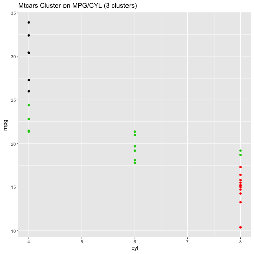

Mtcars Kmeans Cluster
========================================================
author: Gary Mu
date: Dec 10 , 2017
autosize: true

Questions
========================================================

Mtcars data sets contains 32 different cars and their attributes
like:

- Mpg (miles per gallon)
- Cyl: Cylinder
- Wt (weight of cars)

...
etc

I intend to use these attributes to help identify what kinds of cars are close to
each other using Kmeans clusters based on the attributes selected.
This is motivated by finding out how different cars are "like" each other based on
the attributes we are interested in.

Mtcars Data Set
========================================================


```r
head(mtcars)
```

```
                   mpg cyl disp  hp drat    wt  qsec vs am gear carb
Mazda RX4         21.0   6  160 110 3.90 2.620 16.46  0  1    4    4
Mazda RX4 Wag     21.0   6  160 110 3.90 2.875 17.02  0  1    4    4
Datsun 710        22.8   4  108  93 3.85 2.320 18.61  1  1    4    1
Hornet 4 Drive    21.4   6  258 110 3.08 3.215 19.44  1  0    3    1
Hornet Sportabout 18.7   8  360 175 3.15 3.440 17.02  0  0    3    2
Valiant           18.1   6  225 105 2.76 3.460 20.22  1  0    3    1
```


What should the app do?
========================================================

- With the app, users will be able to cluster cars based on the
attributes they are interested in -- for example, what kind of cars are close together
based on MPG & Cylinders.

- Users will be able to choose the number of clusters (groups) to group the cars,
and the cars in the same cluster will be in the same color

How to use the app
========================================================

1. Launch the app
2. On the menu drop down, select the three different attributes of the cars
3. Choose the number of clusters the cars will be group into
4. Examine the output plot

Desired Output - Cluster based on CYL and MPG
========================================================
This is a static example of clustering the cars based on the MPG and Cylinder attributes:




